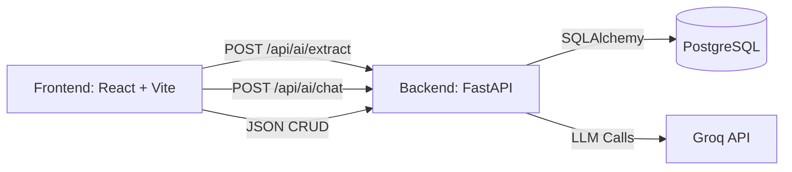

# 🏥 AI-Powered Customer Complaint Management System (QMS)


An intelligent, end-to-end customer complaint intake tool tailored for pharma Quality Management Systems (QMS). Users can paste or upload raw complaint texts, and an advanced AI agent automatically extracts structured fields, classifies risk, drafts a CAPA (Corrective and Preventive Action), and populates a live review form.

**🚀 [Live Demo on Vercel](https://your-project-link.vercel.app)** *(Note: Replace this link with your actual Vercel URL. The Render backend has a ~30-50s cold start if inactive).*

---

## ✨ Features

- **Automated Intake Flow**: Paste text or upload a file (`.txt`/`.eml`). A LangGraph pipeline extracts 12 structured fields in real-time.
- **Complaint Completeness Checker**: Automatically flags and scores missing required fields.
- **AI Risk Classification**: Assesses severity (Critical/Major/Minor) and priority (High/Medium/Low) with ICH Q9-style rationale.
- **Root Cause Recommendation**: Classifies issues against the QMS 6M/Ishikawa framework (Man, Machine, Method, Material, Measurement, Environment).
- **CAPA Recommendation**: Drafts actionable corrective and preventive actions.
- **Executive Summary**: Generates a concise 2–3 sentence summary for QA dashboards.
- **AI Copilot Chat**: Interact with a free-text Q&A assistant grounded in the current complaint's context.

---

## 🏗️ Architecture



### The LangGraph Workflow
To minimize latency and maximize performance, the core AI operations utilize a **parallel fan-out/fan-in** architecture:
1. **Extraction**: Runs first to parse core details.
2. **Parallel Processing**: `completeness_check`, `risk_classification`, and `root_cause_analysis` run concurrently.
3. **Synthesis**: The `capa` node joins risk and root cause data, while the `summary` node synthesizes everything into a final output.

### Model Routing Strategy
- **`gemma2-9b-it`** (Fast & Cost-effective): Used for structured data extraction and summarization.
- **`llama-3.3-70b-versatile`** (Strong Reasoning): Used for risk classification, root cause analysis, CAPA drafting, and the AI Copilot.

---

## 💻 Running Locally

### 1. Backend Setup
```bash
cd backend
python -m venv .venv
source .venv/bin/activate  # On Windows: .venv\Scripts\activate
pip install -r requirements.txt
cp .env.example .env       # Add your GROQ_API_KEY
uvicorn app.main:app --reload
```
*(Defaults to a local SQLite database if `DATABASE_URL` isn't provided)*

### 2. Frontend Setup
```bash
cd frontend
npm install
cp .env.example .env       # Set VITE_API_BASE_URL=http://localhost:8000
npm run dev
```

---

## 🚀 Deployment

The system is optimized for free-tier deployments on **Vercel** (Frontend) and **Render** (Backend & DB).

### Backend (Render)
1. Push this repository to GitHub.
2. In Render, create a **New Blueprint** and point it to the repository. The included `render.yaml` automatically sets up the FastAPI web service and a PostgreSQL database.
3. Set your `GROQ_API_KEY` in the Render dashboard.
4. Set the `CORS_ORIGINS` to your deployed Vercel frontend URL.

### Frontend (Vercel)
1. Import the repository into Vercel.
2. Set the **Root Directory** to `frontend`. Vercel will auto-detect Vite.
3. Add the environment variable `VITE_API_BASE_URL` with your Render backend URL.
4. Deploy!

---

*Built for AIVOA.AI*
